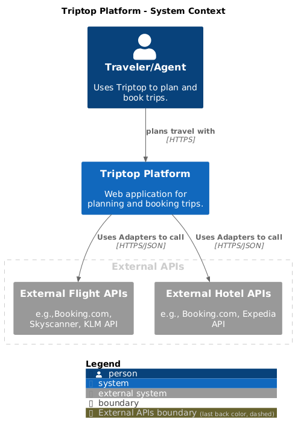

## 2. Context

Het contextdiagram bevat de volgende hoofdcomponenten:

1. **Centraal systeem: "Triptop"**  

2. **Externe entiteiten:**  
   - **External HotelAPI**: Verwerkt boekingen binnen het systeem.  
   - **External FlightAPI**: Regelt het transport voor de reiziger.  

3. **Relaties en datastromen:**  
   - Triptop communiceert met de verschillende services om de processen te beheren, zoals boekingen, betalingen en identificatie.  
   - Reizigers en reisagenten hebben interactie met Triptop, waarschijnlijk via een gebruikersinterface. 

Toelichting op de context van de software inclusief System Context Diagram:
* Functionaliteit
* Gebruikers
* Externe systemen