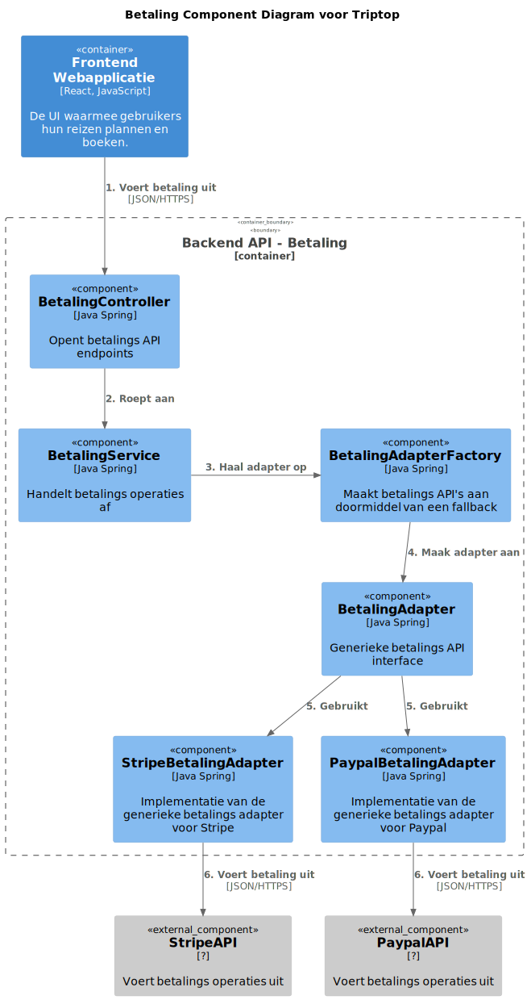
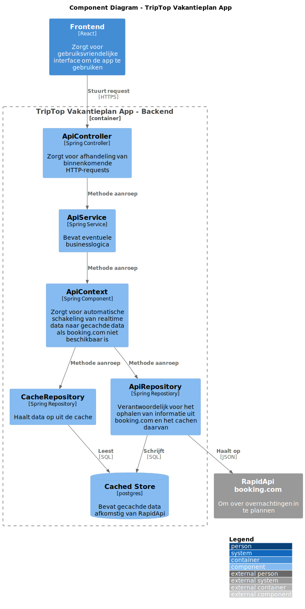
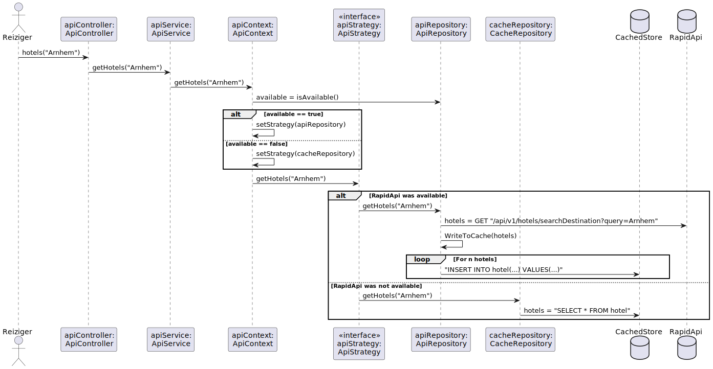

## 7. Software Architecture

### 7.1. Containers

>Elke aanbieder heeft zijn eigen API-specificaties, wat leidt tot complexiteit en verlies van overaciht.
> 
> In het model hebben we Identity Provider en Vervoer API als samengestelde entiteiten gedefinieerd. Dit is gedaan om de complexiteit van het systeem te vereenvoudigen en de overzichtelijkheid te behouden. In werkelijkheid bestaan deze services uit meerdere afzonderlijke API’s van verschillende providers.
> 1. Identity Provider (OAuth2 Login Services)
>
>
>   De Identity Provider in het model vertegenwoordigt meerdere login-diensten waarmee gebruikers zich kunnen authenticeren bij Triptop. In werkelijkheid zou Triptop zich verbinden met verschillende externe OAuth2-providers, zoals:
>    - Google OAuth → Gebruikers kunnen inloggen met hun Google-account.
>    - Microsoft Identity Platform → Ondersteunt inloggen met Microsoft- en Azure AD-accounts
> 
> 2. Vervoer API (Aggregatie van Reisaanbieders) 
> 
> De Vervoer API in het model vertegenwoordigt een aggregatie van meerdere reis- en transportaanbieders. In werkelijkheid haalt Triptop reisopties op uit verschillende externe bronnen:
>    - NS API → Real-time treinroutes en prijzen van Nederlandse Spoorwegen.
>    - KLM API → Vluchtinformatie, prijzen en boekingen via KLM.

#### 7.1.1. Dynamic Diagram: Inloggen

#### 7.1.1. Dynamic Diagram: Reis Plannen

> [!IMPORTANT]
> Voeg toe: Container Diagram plus een Dynamic Diagram van een aantal scenario's inclusief begeleidende tekst.

### 7.2. Components

#### 7.2.1 Component Diagram: Betaling

Voor de onderzoeksvraag: ["Hoe kunnen we ervoor zorgen dat bepaalde bouwstenen automatisch een alternatieve dienst kiezen als de primaire dienst niet beschikbaar is?"](#86-adr-006-passend-pattern-kiezen-voor-bij-fallback-onderzoeksvraag) willen we het Factory Method & Adapter patroon toepassen in het volgende component diagram:

#### 7.2.2 Component Diagram: Reizen

#### 7.2.3 Component Diagram: API

Voor de onderzoeksvraag: "Hoe ga je om met aanroepen van externe services die niet beschikbaar zijn en toch verwacht wordt dat er waardevolle output gegeven
wordt?" willen we het strategy pattern toepassen, dit resulteert in het
volgende component diagram:

Als code zal dit er alsvolgt uitzien:

### 7.3. Design & Code

#### 7.3.1. API Lijst

**Betalingen**

* **Stripe API**
  * **Base URL**: https://api.stripe.com/v1
  * **Pricing**:  
    * **EU**: Card: 1.5% + €0.25, iDEAL: €0.29, Klarna: Starting at 2.99% + €0.35  
    * **UK**: Card: 2.5% + €0.25  
    * **International**: 3.25% + €0.25  
  * **Payment methods**:  
    * Card  
    * Link  
    * Local payment methods (iDEAL, WeChat Pay)  
    * Buy Now Pay Later  

* **Paypal**
  * **Base URL (sandbox)**: https://api-m.sandbox.paypal.com/
  * **Base URL (live)**: https://api-m.paypal.com/ 

* **Beanstream Payments**
  * **Base URL**: https://www.beanstream.com/api/v1  

**Overnachtingen**

* **Booking.com - Demand API**
  * **Base URL**: https://developers.booking.com/api  
  * **Requirements**:  
    * Booking.com Affiliate Partnership needed ([free signup](https://spadmin.booking.com/pc/sign-up.html?lang=en))  

* **Trawix Hotel API**
  * **Requirements**:  
    * (Affiliate) Application needed  

**Huurautos**

* **Sixt SHARE API**
  * **Base URL**: https://api.sixt.com/v1  
  * **Description**:  
    * Car sharing services  

* **Sixt RENT API**
  * **Base URL**: https://api.sixt.com/v1  
  * **Description**:  
    * Car rental services  

* **Trawix Car API**
  * **Requirements**:  
    * (Affiliate) Application needed  

* **Furkot Trips**
  * **Base URL**: https://trips.furkot.com/api/v1  

**Activiteiten**

* **TripAdvisor API**
  * **Base URL**: https://api.tripadvisor.com/api  
  * **Pricing**:  
    * 5k API calls per month for free, overages will be charged  

* **GetYourGuide API**
  * **Requirements**:  
    * (Affiliate) Application needed  

* **Trawix Sightseeing API**
  * **Requirements**:  
    * (Affiliate) Application needed  

**Vervoer**

* **Google Maps - Routes API**
  * **Base URL**: https://maps.googleapis.com/maps/api  
  * **Requirements**:  
    * Credit Card needed  
  * **Pricing**:  
    * 0 - 10,000 free events cap, overages will be charged  

* **NS API**
  * **Base URL**: https://www.ns.nl/en/travel-information/ns-api  
  * **Description**:  
    * Dutch railways information and booking  

* **Amadeus (Asmodeus)**
  * **Base URL**: https://api.amadeus.com/v1  
  * **Description**:  
    * Flight information and booking  

**Eten & Drinken**

* **Allset API**
  * **Base URL**: https://api.allset.com  
  * **Limitations**:  
    * US Market only  

* **MealMe API**
  * **Base URL**: https://api.mealme.ai  
  * **Limitations**:  
    * US & Canada only  

**Authenticatie & Autorisatie**

* **WireMock API**
  * **Base URL**: https://wiremock.org/docs/api  
  * **Description**:  
    * Mock API for testing  

* **OAuth 2.0**
  * **Description**:  
    * Industry standard protocol for authorization  

**Email**

* **ClickSend REST API v3**
  * **Base URL**: https://rest.clicksend.com/v3  
  * **Authentication**:  
    * Basic HTTP authentication  
    * **Username**: Your API username  
    * **Password**: Your API key  

#### 7.3.2. API Mapping Table

| Class::Attribuut           | Is input voor API+Endpoint         | Wordt gevuld door API+Eindpoint | Wordt geleverd door eindgebruiker | Moet worden opgeslagen in de applicatie |
|----------------------------|---------------------------------|--------------------------------|---------------------------------|---------------------------------|
| FlightOffer::departureDate | Flight API /flight-offers (GET) | x                              | x                               | x                               |
| FlightOffer::origin        | Flight API /flight-offers (GET) | x                              | x                               | x                               |
| FlightOffer::destination   | Flight API /flight-offers (GET) | x                              | x                               | x                               |
| FlightOffer::adults        | Flight API /flight-offers (GET) | x                              | x                               |                                 |
| `Verblijf::startDatum`    | `https://booking-com15.p.rapidapi.com/api/v1/hotels/searchHotels` |  | x | x |
| `Verblijf::eindDatum`     | `https://booking-com15.p.rapidapi.com/api/v1/hotels/searchHotels` |  | x | x |
| `Verblijfplaats::locatie` |   | `https://booking-com15.p.rapidapi.com/api/v1/hotels/searchDestination?` |  | x |
| `Verblijfplaats::prijs`   |   | `https://booking-com15.p.rapidapi.com/api/v1/hotels/searchHotels` |  | x |
| ProductCreateParams::name | Stripe API /? | x                              |                                | x                               |
| ProductCreateParams::description        | Stripe API /? | x                              |                                | x                               |
| Product::create   | Stripe API /? | x                              |                                | x                               |
| CustomerCreateParams::name   | Stripe API /? | x                              | x                             |                                |
| CustomerCreateParams::email   | Stripe API /? | x                              | x                               |                                |
| Customer::create   | Stripe API /? | x                              |                                | x                               |
| InvoiceCreateParams::customer   | Stripe API /? | x                              |                                | x                               |
| Invoice::create   | Stripe API /? | x                              |                                | x                               |
_Stripe endpoint addressen worden niet gegeven in de documentatie._

> [!IMPORTANT]
> Voeg toe: Per ontwerpvraag een Class Diagram plus een Sequence Diagram van een aantal scenario's inclusief begeleidende tekst.