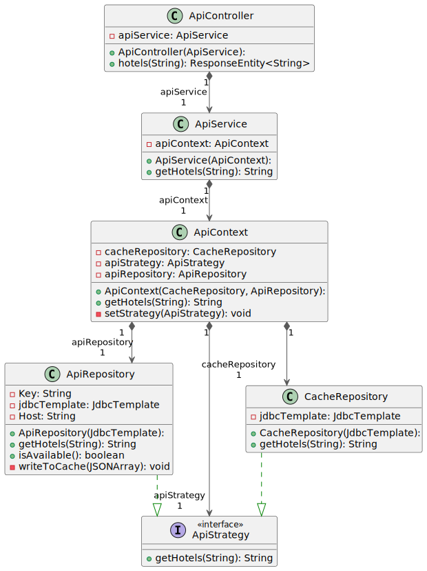

## 7. Software Architectuur

### 7.1. Containers


>Elke aanbieder heeft zijn eigen API-specificaties, wat leidt tot complexiteit en verlies van overaciht.
> 
> In het model hebben we verschillende Vervoer API als samengestelde entiteiten gedefinieerd. Dit is gedaan om de complexiteit van het systeem te vereenvoudigen en de overzichtelijkheid te behouden. In werkelijkheid bestaan deze services uit meerdere afzonderlijke API’s van verschillende providers.
>   De FlightAPI in het model vertegenwoordigt meerdere reis-diensten waarmee gebruikers tickets kunnen boeken bij Triptop. In werkelijkheid zou Triptop zich verbinden met verschillende externe APIs Zie , zoals:
- Booking.com 
- Tripadvisor


#### 7.1.1. Dynamic Diagram: Haal beste vluchten op

> **Begeleidende tekst Dynamic Diagram (Reis Plannen):**
Dit diagram laat de interacties zien tussen de gebruiker, de Triptop applicatie en externe services tijdens het plannen van een reis. De gebruiker start het proces, waarna Triptop via de Facade laag communiceert met verschillende Adapters (bijvoorbeeld voor vluchten, hotels) die op hun beurt externe API's aanroepen. De resultaten worden verzameld en via een Strategy (bijvoorbeeld 'goedkoopste eerst') gepresenteerd aan de gebruiker.


### 7.2. Components

#### 7.2.1 Component Diagram: Adapter & Factory


Voor de onderzoeksvraag behandeld in [ADR-006: Passend pattern kiezen voor bij "Fallback" onderzoeksvraag](#86-adr-006-passend-pattern-kiezen-voor-bij-fallback-onderzoeksvraag), willen we het Factory Method & Adapter patroon toepassen in het volgende component diagram:

> **Begeleidende tekst Component Diagram (Adapter & Factory):**  
Dit diagram toont hoe het Adapter en Factory Method patroon samenwerken binnen de architectuur. De Factory Method zorgt voor het dynamisch leveren van de juiste Adapter-implementatie, afhankelijk van de context of beschikbaarheid. De Adapters zelf dienen als tussenlaag tussen de applicatie en externe API's, waardoor de complexiteit van API-specifieke logica wordt geïsoleerd. Dit maakt het systeem flexibel en uitbreidbaar, omdat nieuwe API's eenvoudig kunnen worden toegevoegd door nieuwe Adapters te implementeren.

#### 7.2.2 Component Diagram: Facade


> **Begeleidende tekst Component Diagram (Facade):**  
Het Facade patroon wordt gebruikt om een vereenvoudigde klasse te bieden aan de subsystemen van de applicatie. In dit diagram zien we hoe de Facade werkt als een centrale toegangspoort voor de client, terwijl het de interacties met de onderliggende Adapters en Strategies beheerd. Dit patroon helpt bij het verminderen van de afhankelijkheden tussen de client en de interne structuur van het systeem.

#### 7.2.3 Component Diagram: Strategy


Voor de onderzoeksvraag behandeld in [ADR-002: Strategy pattern](#82-adr-002-strategy-pattern) ("Hoe ga je om met aanroepen van externe services die niet beschikbaar zijn en toch verwacht wordt dat er waardevolle output gegeven wordt?"), willen we het strategy pattern toepassen. Dit resulteert in het volgende component diagram:


Als code zal dit er alsvolgt uitzien:



#### 7.2.4 Component Diagram: Alle patterns


### 7.3 Design & Code

#### 7.3.1 API Lijst

> [!NOTE]
> De onderstaande lijst toont een overzicht van potentiële externe API's die geïntegreerd *kunnen* worden met Triptop via de Adapter-structuur. Voor het huidige prototype zijn voornamelijk **Booking.com** (voor overnachtingen) en **TripAdvisor** (voor activiteiten) actief geïmplementeerd als voorbeeld. De architectuur is echter ontworpen om eenvoudig uitbreidbaar te zijn met andere aanbieders. Zie [Sectie 7.3.3](#733-uitbreidbaarheid-met-nieuwe-apis) voor hoe je een nieuwe API toevoegt.


**Overnachtingen**

* **Trawix Hotel API**
  * **Requirements**:  
    * (Affiliate) Application needed  


**Vervoer**

* **TripAdvisor API**
  * **Base URL**: https://api.tripadvisor.com/api  
  * **Pricing**:  
    * 5k API calls per month for free, overages will be charged  

* **GetYourGuide API**
  * **Requirements**:  
    * (Affiliate) Application needed  

* **Trawix Sightseeing API**
  * **Requirements**:  
    * (Affiliate) Application needed  

**Vervoer**

* **TripAdvisor API**
  * **Base URL**: https://api.tripadvisor.com/api  
  * **Pricing**:  
    * 5k API calls per month for free, overages will be charged  

* **Booking.com - Demand API**
  * **Base URL**: https://developers.booking.com/api  
  * **Requirements**:  
    * Booking.com Affiliate Partnership needed ([free signup](https://spadmin.booking.com/pc/sign-up.html?lang=en))  

* **Google Maps - Routes API**
  * **Base URL**: https://maps.googleapis.com/maps/api  
  * **Requirements**:  
    * Credit Card needed  
  * **Pricing**:  
    * 0 - 10,000 free events cap, overages will be charged  

* **NS API**
  * **Base URL**: https://www.ns.nl/en/travel-information/ns-api  
  * **Description**:  
    * Dutch railways information and booking  

* **Amadeus (Asmodeus)**
  * **Base URL**: https://api.amadeus.com/v1  
  * **Description**:  
    * Flight information and booking  


#### 7.3.2 API Mapping Table

| Class::Attribuut           | Is input voor API+Endpoint         | Wordt gevuld door API+Eindpoint | Wordt geleverd door eindgebruiker | Moet worden opgeslagen in de applicatie |
|----------------------------|---------------------------------|--------------------------------|---------------------------------|---------------------------------|
| FlightOffer::departureDate | Flight API /flight-offers (GET) | x                              | x                               | x                               |
| FlightOffer::origin        | Flight API /flight-offers (GET) | x                              | x                               | x                               |
| FlightOffer::destination   | Flight API /flight-offers (GET) | x                              | x                               | x                               |
| FlightOffer::adults        | Flight API /flight-offers (GET) | x                              | x                               |                                 |
| `Verblijf::startDatum`    | `https://booking-com15.p.rapidapi.com/api/v1/hotels/searchHotels` |  | x | x |
| `Verblijf::eindDatum`     | `https://booking-com15.p.rapidapi.com/api/v1/hotels/searchHotels` |  | x | x |
| `Verblijfplaats::locatie` |   | `https://booking-com15.p.rapidapi.com/api/v1/hotels/searchDestination?` |  | x |
| `Verblijfplaats::prijs`   |   | `https://booking-com15.p.rapidapi.com/api/v1/hotels/searchHotels` |  | x |
| ProductCreateParams::name | Stripe API /? | x                              |                                | x                               |
| ProductCreateParams::description        | Stripe API /? | x                              |                                | x                               |
| Product::create   | Stripe API /? | x                              |                                | x                               |
| CustomerCreateParams::name   | Stripe API /? | x                              | x                             |                                |
| CustomerCreateParams::email   | Stripe API /? | x                              | x                               |                                |
| Customer::create   | Stripe API /? | x                              |                                | x                               |
| InvoiceCreateParams::customer   | Stripe API /? | x                              |                                | x                               |
| Invoice::create   | Stripe API /? | x                              |                                | x                               |
_Stripe endpoint addressen worden niet gegeven in de documentatie._

### 7.3.3 Sequence Diagram


**Begeleidende tekst Sequence Diagram (7.3.3):**
Dit diagram toont de interacties tussen de verschillende componenten tijdens het zoeken naar de beste vlucht. De client roept de Facade aan, die vervolgens via de Factory beschikbare Adapters ophaalt. Elke Adapter communiceert met een externe API om vluchtgegevens op te halen. De Facade verzamelt de resultaten en gebruikt een Strategy om de beste vlucht te bepalen, die uiteindelijk aan de client wordt teruggegeven.

### 7.3.4 Class Diagram


**Begeleidende tekst Class Diagram (7.3.4):**
Dit diagram geeft een overzicht van de klassenstructuur voor het zoeken naar vluchten. Het toont de interfaces (`IFlightAdapter`, `IFlightSearchStrategy`), concrete implementaties (zoals `SkyscannerAdapter` en `CheapestFlightStrategy`), en de Facade (`FlightFacade`) die de interactie tussen de client en de adapters/strategieën beheert. De Factory (`FlightAdapterFactory`) zorgt voor het leveren van beschikbare adapters, terwijl de Facade de strategie gebruikt om de beste vlucht te selecteren.

### 7.3.5 Uitbreidbaarheid met Nieuwe API's

Een belangrijk doel van de gekozen architectuur (met Facades, Adapters en Factories) is de **uitbreidbaarheid**. Het toevoegen van een nieuwe externe dienst (bijvoorbeeld een extra hotelprovider zoals Expedia, of een andere vluchtaanbieder) is relatief eenvoudig en vereist minimale aanpassingen aan de bestaande code buiten de nieuwe Adapter zelf.

**Stappen voor het toevoegen van een nieuwe API (bijv. Expedia voor hotels):**

1.  **Identificeer/Gebruik de Standaard Interface:** Bepaal welke bestaande interface de nieuwe dienst moet implementeren. Voor hotels is dit `IHotelAdapter`. Als er nog geen interface bestaat voor het domein (bijv. autoverhuur), definieer dan eerst een nieuwe interface (bv. `IRentalCarAdapter`).
    ```java
    // Voorbeeld: Bestaande interface (vereenvoudigd)
    package ese.triptop.features.hotels.adapter;
    import ese.triptop.features.hotels.domain.Hotel;
    import java.util.List;

    public interface IHotelAdapter {
        List<Hotel> getHotels(String location, String checkInDate, String checkOutDate, int guests);
        boolean isAvailable();
    }
    ```

2.  **Implementeer de Concrete Adapter:** Maak een nieuwe klasse die de interface implementeert. Deze klasse bevat alle logica specifiek voor de nieuwe API (authenticatie, request opbouw, response parsing, mapping naar Triptop's domeinmodel).
    ```java
    package ese.triptop.features.hotels.adapter; // Plaats in de juiste package

    import ese.triptop.features.hotels.domain.Hotel;
    import org.springframework.stereotype.Component; // Belangrijk voor Spring DI / Factory
    import java.util.List;
    import java.util.ArrayList;
    // Importeer je HTTP client (bv. kong.unirest.core.*)

    @Component // Maakt de adapter vindbaar voor de HotelAdapterFactory (via Spring DI)
    public class ExpediaHotelAdapter implements IHotelAdapter {

        private static final String EXPEDIA_API_ENDPOINT = "https://api.expedia.com/v2/hotels"; // Fictief endpoint
        private static final String API_KEY = System.getenv("EXPEDIA_API_KEY"); // Laad API key veilig (bv. via environment variable)

        @Override
        public List<Hotel> getHotels(String location, String checkInDate, String checkOutDate, int guests) {
            List<Hotel> hotels = new ArrayList<>();
            System.out.println("[ExpediaHotelAdapter] Searching hotels via Expedia API for: " + location);

            if (API_KEY == null || API_KEY.isEmpty()) {
                 System.err.println("[ExpediaHotelAdapter] API Key not configured.");
                 return hotels; // Return empty list if key is missing
            }

            try {
                // === Logica specifiek voor Expedia API ===
                // 1. Bouw het request (parameters, headers met API Key)
                // HttpResponse<JsonNode> response = Unirest.get(EXPEDIA_API_ENDPOINT)
                //         .header("Authorization", "Bearer " + API_KEY)
                //         .queryString("location", location)
                //         .queryString("checkIn", checkInDate)
                //         .queryString("checkOut", checkOutDate)
                //         .queryString("guests", guests)
                //         .asJson();

                // 2. Verwerk de response
                // if (response.getStatus() == 200) {
                //     System.out.println("[ExpediaHotelAdapter] Expedia API call successful.");
                //     // 3. Map de JSON response naar Triptop's List<Hotel> objecten
                //     // hotels = mapExpediaResponseToHotels(response.getBody());
                       // Dummy data voor dit voorbeeld:
                       hotels.add(new Hotel("Expedia", "Marriott", 180.0, 4.7));
                       hotels.add(new Hotel("Expedia", "Ibis Budget", 85.0, 3.9));
                // } else {
                //     System.err.println("[ExpediaHotelAdapter] Expedia API call failed: " + response.getStatus() + " " + response.getStatusText());
                // }
                 System.out.println("[ExpediaHotelAdapter] Simulated search complete."); // Simulatie voor guidebook

            } catch (Exception e) { // Vang specifieke exceptions (bv. UnirestException)
                System.err.println("[ExpediaHotelAdapter] Error during Expedia API call: " + e.getMessage());
                // Optioneel: log de stack trace
            }
            return hotels;
        }

        @Override
        public boolean isAvailable() {
            // Implementeer een health check specifiek voor de Expedia API
            // Dit kan een simpele ping zijn of een check op een status endpoint
            System.out.println("[ExpediaHotelAdapter] Checking availability (simulated: true).");
            // Voorbeeld: probeer een simpele request
            // try {
            //    HttpResponse<String> response = Unirest.get("https://api.expedia.com/status").asString(); // Fictief status endpoint
            //    return response.getStatus() == 200;
            // } catch (Exception e) {
            //    return false;
            // }
            return true; // Simpel voorbeeld voor guidebook
        }

        // Helper methode voor het mappen van de API response naar domein objecten
        // private List<Hotel> mapExpediaResponseToHotels(JsonNode responseBody) {
        //     List<Hotel> mappedHotels = new ArrayList<>();
        //     // ... Logica om JSON te parsen en Hotel objecten te maken ...
        //     return mappedHotels;
        // }
    }
    ```

3.  **Registratie (Automatisch via `@Component`):** Door de nieuwe adapterklasse te annoteren met `@Component` (of een vergelijkbare Spring-stereotype zoals `@Service`), zal Spring's dependency injection mechanisme deze automatisch detecteren. De `HotelAdapterFactory` (of een vergelijkbare factory die alle `IHotelAdapter` beans injecteert) zal de nieuwe adapter dan automatisch meenemen wanneer `getAvailableAdapters()` wordt aangeroepen. Er zijn geen handmatige registratiestappen nodig in de Factory zelf.

4.  **Configuratie:** Zorg ervoor dat eventuele benodigde configuratie (zoals API keys) beschikbaar is voor de nieuwe adapter (bijvoorbeeld via environment variables of een configuratiebestand).

Na deze stappen zal de `HotelFacade` automatisch de nieuwe `ExpediaHotelAdapter` gebruiken (indien beschikbaar volgens de `isAvailable()` check) bij het zoeken naar hotels, zonder dat de code van de Facade of de client aangepast hoeft te worden. Dit demonstreert de kracht van de gekozen architectuur voor schaalbaarheid en onderhoudbaarheid.