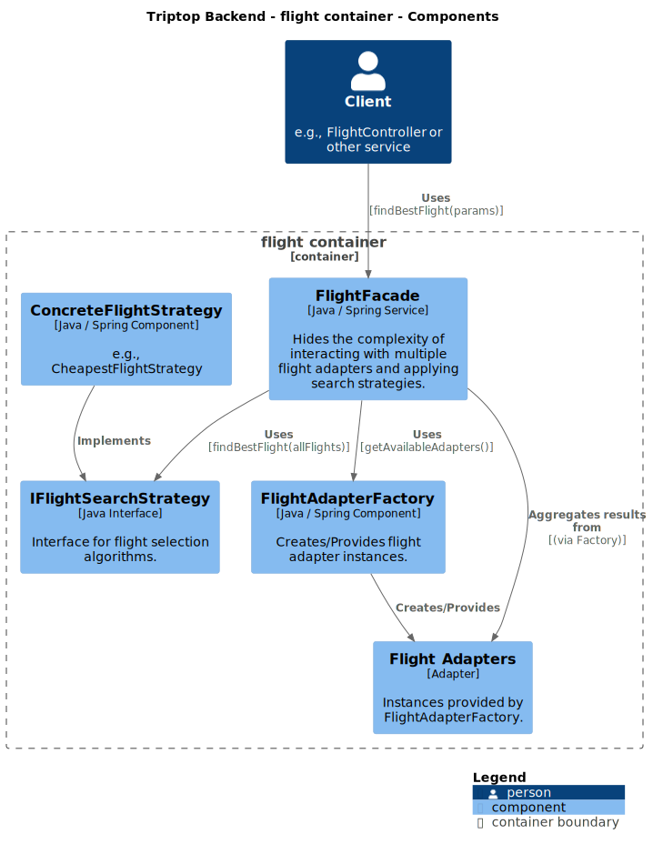

## 8. Architectural Decision Records

### 8.1. ADR-001 Postgres database

#### Auteur

Ramon Bijl

#### Context

Voor de TripTop applicatie willen we een hoog-beschikbare en schaalbare
backend implementeren waarbij gegevens uit meerdere API's worden opgeslagen
in een database.

#### Overwogen opties

| Factor             | MySQL            | Postgres         | MariaDB          | SQL Server       |
|--------------------|------------------|------------------|------------------|------------------|
| **Prestaties**       | Minder geschikt voor grote datasets | Sterk bij complexe queries en grote datasets | Over het algemeen sneller dan MySQL | Goede prestaties |
| **Uitbreidbaarheid** | Beperkt          | Zeer hoog | Beperkt          | Gemiddeld |
| **Licentie**         | Open-source (GPL) | Open-source (PostgreSQL License) | Open-source (GPL) | Proprietair (Microsoft) |
| **Complexiteit**     | Eenvoudig | Complexer maar krachtiger | Eenvoudig (MySQL compatible) | Gemiddelde leercurve |

#### Keuze

We hebben gekozen om gebruik te maken van Postgres omdat dit uitstekende prestaties bied
en een hoge uitbreidbaarheid heeft, dit sluit goed aan bij de wensen van onze applicatie. Daarnaast
is het gratis te gebruiken en zijn er geen licentie kosten aan verbonden wat
voor ons erg belangrijk is.

#### Status 

Geaccepteerd

#### Gevolgen

Positief:

 - Geen extra licentie kosten
 - Hoge schaalbaarheid en makkelijk uit te breiden
 - Hoge prestaties

Negatief:

 - Relatief hogere leercurve voor (nieuwe) teamleden

### 8.2. ADR-002 Strategy pattern

#### Auteur

Ramon Bijl

#### Context

We moeten gegevens ophalen die afkomstig kunnen zijn van een externe API of een
gecachte database, afhankelijk van beschikbaarheid. De externe API biedt de
meest actuele gegevens, maar kan op ieder moment onbereikbaar zijn. De
database functioneert als een alternatief voor wanneer de externe API
onbereikbaar is. We hebben een software ontwerp nodig dat tussen deze 2
opties kan schakelen, waarbij het ophalen van gegevens uit de externe API de
hogste prioriteit heeft terwijl de code schoon, onderhoudbaar en leesbaar
blijft.

#### Overwogen opties

Voor de implementatie van deze oplossing hebben we de volgende design
patterns overwogen:

| Design pattern | Flexibiliteit | Onderhoudbaarheid | Testbaarheid |
|-------|---------------|-------------------|--------------|
| **If-Else Logica** | Laag | Laag - Kan erg onoverzichtelijk worden | Laag – moeilijk afzonderlijk te testen |
| **Strategy Pattern** | Hoog – eenvoudig nieuwe strategieën toe te voegen | Hoog – scheidt verantwoordelijkheden in aparte klassen | Hoog – strategieën kunnen onafhankelijk worden getest |
| **Factory Pattern** | Gemiddeld - Kan tot tight-coupling leiden | Gemiddeld - Kan complex worden als er veel classes worden toegevoegd | Gemiddeld - Code kan makkelijker te testen zijn |

#### Keuze

We hebben gekozen voor het Strategy Pattern omdat dit biedt:
- Een duidelijke scheiding van verantwoordelijkheden.
- De mogelijkheid om gemakkelijk opties uit te breiden en te wijzigen.
- Verbeterde testbaarheid.

#### Status

Geaccepteerd

#### Gevolgen

Positief:

 - Verbeterde onderhoudbaarheid en uitbreidbaarheid.
 - Maken van unit-tests gaat makkelijker
 - Duidelijke scheiding van verantwoordelijkheden.

Negatief:

 - Vereist dat ontwikkelaars bekend zijn met het Strategy Pattern, dit kan extra tijd kosten.

### 8.3. ADR-003 Stripe API Test Modus

#### Auteur: 
Mees van Aarsen

#### Status
_**Geaccepteerd**_
#### Context
Ik ga een prototype feature opzetten voor het verwerken van betalingen. Voor het opzetten van een prototype waren meerdere API opties beschikbaar (RapidAPI, Stripe API). 

- De RapidAPI geeft enkel mockdata terug.
- De Stripe API heeft een test modus, waarin men direct gebruik kan maken van de echte API. Zonder de kans dat men gefactureerd wordt voor gebruik.

#### Besluit
Ik ga het prototype ontwikkelen doormiddel van de Stripe API. Daarmee kan men zonder de mogelijkheid gefactureerd te worden hen integratie ontwikkelen en testen.

### Gevolgen

#### Positief:

- Alle functionaliteit wordt volgens de door Stripe gegeven modellen ontwikkeld
- Implementatie zal direct van prototype naar product over kunnen gaan.

#### Negatief:

- Vergroot mogelijk de data-strucuur van de DB met Stripe modellen.
- Contact naar Stripe gaat via de Stripe.class, geen direct zicht op de endpoints.
- Vereist ontwikkeling en onderhoud van adapter-services

#### Implementatiedetails

- Voor elke categorie externe services (vervoer, betalingen, authenticatie) ontwikkelen we een dedicated adapter-service
- Elke adapter implementeert een standaard interface die onze core backend gebruikt
- Adapters vertalen de specifieke formaten/protocollen van de Stripe API naar ons interne datamodel

### 8.4. ADR-004 API Gateway Pattern voor externe API-integratie

#### Auteur
Pedro van Douveren

> vervangen door een ander, refactor

> **Interoperability:** "Hoe zorg je dat een wijziging in een of meerdere APIs niet leidt tot een grote wijziging in de applicatie?

#### Status
_**Deprecated**_
#### Context
> Triptop integreert met meerdere externe APIs (vervoersaanbieders, betalingssystemen, identity providers). Wijzigingen in deze APIs kunnen grote impact hebben op onze applicatie als we deze direct integreren. 
> We moeten een manier vinden om wijzigingen in externe APIs op te vangen zonder dat dit leidt tot grootschalige aanpassingen in onze front-end of core back-end systemen.
#### Besluit
> We implementeren een API Gateway pattern waarbij alle communicatie met externe diensten via speciale adapter-services verloopt. 
> Deze services vormen een abstraherende laag tussen onze applicatie en externe APIs.

### Gevolgen

#### Positief:

- Wijzigingen in externe APIs worden opgevangen in de gateway/adapter laag
- Front-end communiceert alleen met onze eigen gestandardiseerde interne API
- Eenvoudiger monitoring van externe API-aanroepen op één plaats
- Maakt A/B testing tussen verschillende externe providers mogelijk

#### Negatief:

- Extra architectuurlaag verhoogt complexiteit
- Potentiële performance overhead
- Vereist ontwikkeling en onderhoud van adapter-services

#### Implementatiedetails

- Voor elke categorie externe services (vervoer, betalingen, authenticatie) ontwikkelen we een dedicated adapter-service
- Elke adapter implementeert een standaard interface die onze core backend gebruikt
- Adapters vertalen de specifieke formaten/protocollen van externe APIs naar ons interne datamodel

### 8.5. ADR-005 Toepassen van het Facade-patroon

#### Auteur
Pedro van Douveren

>**Interoperability:** Hoe kunnen we verschillende externe vervoersservices (zoals Google Maps of een veerdienst API) integreren zonder afhankelijk te worden van hun specifieke implementaties?

#### Status
_**Geaccepteerd**_

#### Context
> De huidige code in het pakket `ese.triptop.features.wiremock` communiceert direct met meerdere externe APIs (Identity, Flight Offers, Booking, TripAdvisor) via de `Unirest`-bibliotheek. Dit leidt tot de volgende problemen:  
> - **Verspreide logica**: De details van API-communicatie (URL-opbouw, verzoeken maken, reacties verwerken, foutafhandeling) zijn verspreid over meerdere klassen.
> - **Herhaling**
> - **Hoge koppeling**: Clientcode is direct afhankelijk van de specifieke externe API’s en de `Unirest`-bibliotheek.
> - **Complexiteit**: Om de interactie met de APIs te begrijpen, moet men door meerdere klassen en methodes kijken.
> - **Moeilijk onderhoud**: Wijzigingen in een externe API vereisen aanpassingen op meerdere plekken. Hardcoded URLs en API-sleutels maken dit nog lastiger.

Het doel is om de interactie met deze externe diensten te vereenvoudigen en de afhankelijkheden te verminderen.

#### Beslissing
We passen het **Facade-patroon** toe om de complexiteit van communicatie met de externe reis-API’s te verbergen.  

Daarom introduceren we een **`TravelApiServiceFacade`-interface** die eenvoudige methodes aanbiedt, zoals:
- `findFlights`
- `findHotels`
- `findRestaurants`

De implementatie **`TravelApiServiceFacadeImpl`** zal deze interface gebruiken om de volgende details te verbergen:
- HTTP-verzoeken uitvoeren via `Unirest`.
- Specifieke API-eindpunten en parameters afhandelen.
- Basisfouten verwerken en API-reacties omzetten.

Clientcode communiceert alleen met de **Facade-interface**, zonder afhankelijk te zijn van de onderliggende API’s.

#### Gevolgen

##### Positief:
- **Eenvoudigere interface**: Eén toegangspunt voor interactie met externe reis-API's.
- **Lagere koppeling**: De clientcode is niet direct afhankelijk van API-details of `Unirest`.
- **Betere leesbaarheid & onderhoudbaarheid**: Alle API-logica zit op één plek. Wijzigingen in externe API’s hebben minder impact.
- **Encapsulatie**: Verbergt de complexiteit van authenticatie en API-aanroepen.

##### Negatief:
- **Mogelijke 'God Object'-valkuil**: Als de Facade te veel taken krijgt, kan het een te grote verantwoordelijkheid krijgen. *(Oplossing: Focus beperken tot reis-API's.)*
- **Extra abstractielaag**: Dit voegt een kleine overhead toe, maar is hier gerechtvaardigd door de complexiteit die wordt verborgen.

#### Toegepaste ontwerpprincipes
- **Encapsulatie**: De interne werking van API-communicatie wordt verborgen achter een interface.
- **Information Hiding**: Clients hoeven alleen te weten *wat* de Facade doet, niet *hoe*.
- **Single Responsibility Principle (SRP)**: De Facade biedt een vereenvoudigde interface, terwijl de onderliggende logica in de implementatie zit. *(Let op: de Facade moet niet te veel verantwoordelijkheden krijgen!)*
- **Law of Demeter**: Clientcode communiceert alleen met de Facade en niet direct met externe API's of de `Unirest`-bibliotheek.

### 8.6. ADR-006 Passend pattern kiezen voor bij "Fallback" onderzoeksvraag

#### Auteur
Mees van Aarsen

#### Status
_**Geaccepteerd**_

#### Context
Bij Triptop moet de betalingsverwerking betrouwbaar werken, zelfs wanneer externe betalingsproviders uitvallen of onbereikbaar zijn. Onze onderzoeksvraag naar "Fallback" technieken heeft uitgewezen dat we een robuust mechanisme nodig hebben dat:

* Snel detecteren wanneer een primaire betalingsprovider (Stripe) niet beschikbaar is
* Automatisch overschakelt naar een alternatieve provider (Paypal) zonder gebruikersinterventie
* Periodiek controleert of de primaire provider weer beschikbaar is
* Consistente dataformaten behoudt tussen verschillende providers

Voor het opzetten van de bovenstaande criteria is het ICT Research Pattern ['Choose fitting technologies'](https://ictresearchmethods.nl/patterns/choose-fitting-technology/) toegepast. Doormiddel van de 5xW en 1xH vragen op te stellen als onderdeel van het "Veld" onderzoek.

[-> Pattern Onderzoek](pattern_onderzoek_mees.md)

#### Besluit

Bij het implementeren van failover tussen betalings-API's komt het Circuit Breaker als beste optie naar voren.

| Pattern → Criteria ↓ | Circuit Breaker | Retry met Exponential Backoff | Fallback Pattern | Service Discovery | Load Balancing met Health Checks | Bulkhead Pattern | API Gateway met Failover Logic |
| --- | --- | --- | --- | --- | --- | --- | --- |
| 1. Detectie binnen 5 seconden | X | X | X | X | X |  | X |
| 2. Automatische overschakeling | X | X | X | X | X |  | X |
| 3. Maximaal 5 retries | X | X |  |  |  |  | X |
| 4. Logging van failovers | X | X | X | X | X | X | X |
| 5. Periodieke controle primaire dienst | X | X |  | X | X |  | X |
| 6. Consistente dataformaten |  |  | X |  |  |  | X |
| 7. Max 1 sec extra verwerkingstijd | X |  | X | X | X | X |  |

We implementeren een Circuit Breaker Pattern in combinatie met het Fallback Pattern voor onze betalingsverwerkingsmodule. Dit betekent:

1. We bouwen een PaymentAdapterFactory die het circuit breaker mechanisme implementeert
2. We definiëren een generieke IPaymentAdapter interface voor alle betalingsproviders
3. We creëren concrete adapter-implementaties voor Stripe (primair) en Paypal (fallback)
4. Het circuit "opent" wanneer Stripe een bepaald aantal fouten geeft binnen een tijdsperiode
5. Wanneer het circuit open is, worden verzoeken direct doorgestuurd naar Paypal
6. Het circuit "sluit" weer zodra een verbinding mogelijk is met Stripe.

Zie klassendiagram:

#### Gevolgen

##### Positief:

* Wijzigingen in externe APIs worden opgevangen in de adapter laag
* Front-end communiceert alleen met onze eigen gestandardiseerde interne API
* Eenvoudiger monitoring van externe API-aanroepen op één plaats
* Maakt A/B testing tussen verschillende externe providers mogelijk

##### Negatief:

* Extra architectuurlaag verhoogt complexiteit
* Potentiële performance overhead
* Vereist ontwikkeling en onderhoud van adapter-services

#### Implementatiedetails

* Voor elke categorie externe services (vervoer, betalingen, authenticatie) ontwikkelen we een dedicated adapter-service
* Elke adapter implementeert een standaard interface die onze core backend gebruikt
* Adapters vertalen de specifieke formaten/protocollen van externe APIs naar ons interne datamodel

### 8.7. ADR-007 Implementatie van Adapter Pattern voor betalingsintegraties

#### Auteur
Mees van Aarsen

#### Status
Geaccepteerd

#### Context
Na het besluit om het Circuit Breaker Pattern te implementeren voor betalingsfallback ([ADR-004](#84-adr-004-passend-pattern-kiezen-voor-bij-fallback-onderzoeksvraag)), moesten we een geschikte architectuur kiezen om verschillende betalingsproviders te integreren. We hadden behoefte aan een uniforme manier om met verschillende APIs te communiceren, waarbij elk van deze APIs zijn eigen formaten, authenticatiemethodes en endpoints heeft.

Tijdens de implementatie van het Circuit Breaker mechanisme werd duidelijk dat we een gestandaardiseerde interface nodig hadden om:

* De business logic volledig te scheiden van API-specifieke implementatiedetails
* Een consistente manier te hebben om verschillende betalingsproviders uit te wisselen
* Te zorgen dat nieuwe betalingsproviders eenvoudig kunnen worden toegevoegd

#### Besluit
We implementeren het Adapter Pattern voor alle betalingsintegraties. Dit betekent:

* We definiëren een abstracte `IPaymentAdapter` interface die de gemeenschappelijke operaties voor alle betalingsproviders beschrijft
* Voor elke betalingsprovider creëren we een specifieke adapter-klasse die deze interface implementeert
* De business logic werkt uitsluitend met de abstracte interface, zonder kennis van de concrete implementaties
* De Factory uit ADR-003 is verantwoordelijk voor het leveren van de juiste adapter-instantie

#### Gevolgen

##### Positief:

* Volledige ontkoppeling tussen business logic en externe API implementaties
* Eenvoudig toevoegen van nieuwe betalingsproviders zonder wijzigingen in de core applicatie
* Gestandaardiseerde foutafhandeling en logging over alle providers
* Mogelijkheid om mocks en test-adapters te gebruiken voor efficiënte testbaarheid
* Consistente response formats ongeacht de gebruikte provider

##### Negatief:

* Mogelijke overhead door de extra abstractielaag
* Risico op "lowest common denominator" API door gemeenschappelijke interface
* Meer code en klassen om te onderhouden
* Mogelijke complexiteit bij het mappen van provider-specifieke functies naar het gestandaardiseerde model

#### Implementatiedetails

* De `IPaymentAdapter` interface definieert methoden zoals:

  * `processInvoicePayment(InvoiceRequest request): InvoiceResponse`
  * `isAvailable(): boolean`

* De concrete adapters zoals `StripePaymentAdapter` en `PaypalPaymentAdapter` implementeren deze interface
* Elke adapter is verantwoordelijk voor:
* Mappings tussen ons interne datamodel en het provider-specifieke formaat
* Provider-specifieke authenticatie en API-aanroepen
