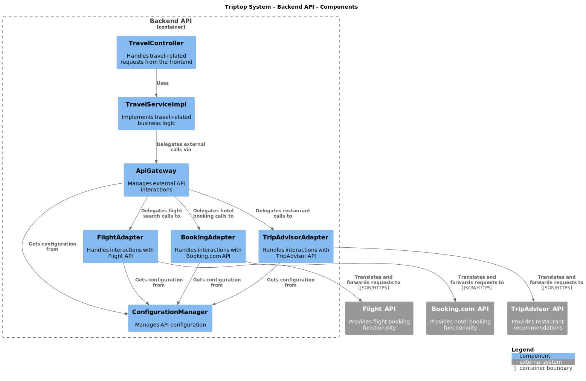
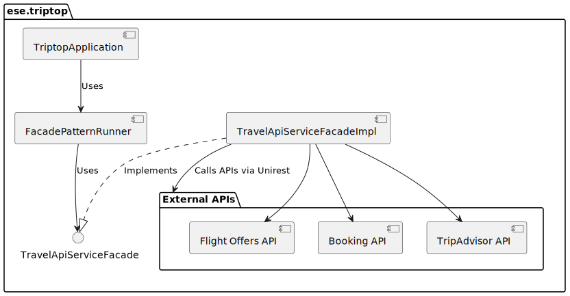

# Software Guidebook Triptop

## 1. Introduction
Dit software guidebook geeft een overzicht van de Triptop-applicatie. Het bevat een samenvatting van het volgende: 
1. De vereisten, beperkingen en principes. 
1. De software-architectuur, met inbegrip van de technologiekeuzes op hoog niveau en de structuur van de software. 
1. De ontwerp- en codebeslissingen die zijn genomen om de software te realiseren.
1. De architectuur van de infrastructuur en hoe de software kan worden geinstalleerd. 

## 2. Context


Het contextdiagram bevat de volgende hoofdcomponenten:

1. **Centraal systeem: "Triptop"**  

2. **Externe entiteiten:**  
   - **IdentityProvider**: Zorgt voor authenticatie en autorisatie.  
   - **BoekingService**: Verwerkt boekingen binnen het systeem.  
   - **TransportService**: Regelt het transport voor de reiziger.  
   - **BetaalService**: Afhandeling van betalingen binnen het systeem.

3. **Relaties en datastromen:**  
   - Triptop communiceert met de verschillende services om de processen te beheren, zoals boekingen, betalingen en identificatie.  
   - Reizigers en reisagenten hebben interactie met Triptop, waarschijnlijk via een gebruikersinterface. 

Toelichting op de context van de software inclusief System Context Diagram:
* Functionaliteit
* Gebruikers
* Externe systemen

## 3. Functional Overview

Om de belangrijkste features toe te lichten zijn er user stories en twee domain stories gemaakt en een overzicht van het domein in de vorm van een domeinmodel. Op deze plek staat typisch een user story map maar die ontbreekt in dit voorbeeld.

### 3.1 User Stories

#### 3.1.1 User Story 1: Reis plannen

Als gebruiker wil ik een zelfstandig op basis van diverse variabelen (bouwstenen) een reis kunnen plannen op basis van mijn reisvoorkeuren (wel/niet duurzaam reizen, budget/prijsklasse, 's nachts reizen of overdag etc.) zodat ik op vakantie kan gaan zonder dat hiervoor een reisbureau benodigd is.

#### 3.1.2 User Story 2: Reis boeken

Als gebruiker wil ik een geplande reis als geheel of per variabele (bouwsteen) boeken en betalen zodat ik op vakantie kan gaan zonder dat hiervoor een reisbureau benodigd is.

#### 3.1.3 User Story 3: Reis cancelen

Als gebruiker wil ik een geboekte reis, of delen daarvan, kunnen annuleren zodat ik mijn geld terug kan krijgen zonder inmenging van een intermediair zoals een reisbureau.

#### 3.1.4 User Story 4: Reisstatus bewaren 

Als gebruiker wil ik mijn reisstatus kunnen bewaren zonder dat ik een extra account hoef aan te maken zodat ik mijn reis kan volgen zonder dat ik daarvoor extra handelingen moet verrichten.

#### 3.1.5 User Story 5: Bouwstenen flexibel uitbreiden

Als gebruiker wil ik de bouwstenen van mijn reis flexibel kunnen uitbreiden met een zelf te managen stap (bijv. met providers die niet standaard worden aangeboden zoals een andere reisorganisatie, hotelketen etc.) zodat ik mijn reis helemaal kan aanpassen aan mijn wensen.

### 3.2 Domain Story Reis Boeken (AS IS)


**Uitleg:** Dit diagram toont het proces van een reis boeken zoals het *nu* (AS IS) vaak gebeurt, mogelijk met veel handmatige stappen of via traditionele reisbureaus. Het dient als startpunt om de verbeteringen van Triptop te begrijpen.

### 3.3 Domain Story Reis Boeken (TO BE)


**Uitleg:** Dit diagram laat zien hoe het proces van een reis boeken er *in de toekomst* (TO BE) met Triptop uit zou moeten zien. Het benadrukt de geautomatiseerde interacties en het gebruik van verschillende bouwstenen (services) binnen het Triptop platform.

### 3.4 Domain Model


**Uitleg:** Het domeinmodel geeft een overzicht van de belangrijkste concepten (entiteiten) binnen het Triptop domein en hun onderlinge relaties. Dit helpt om de structuur van de data en de business logica te begrijpen. Belangrijke entiteiten zijn bijvoorbeeld `Reis`, `Bouwsteen`, `Gebruiker`, `Boeking`, etc.

## 4. Quality Attributes

Voordat deze casusomschrijving tot stand kwam, heeft de opdrachtgever de volgende ISO 25010 kwaliteitsattributen benoemd als belangrijk:
* Compatibility -> Interoperability (Degree to which a system, product or component can exchange information with other products and mutually use the information that has been exchanged)
* Reliability -> Fault Tolerance (Degree to which a system or component operates as intended despite the presence of hardware or software faults)
* Maintainability -> Modularity (Degree to which a system or computer program is composed of discrete components such that a change to one component has minimal impact on other components)
* Maintainability -> Modifiability (Degree to which a product or system can be effectively and efficiently modified without introducing defects or degrading existing product quality)
* Security -> Integrity (Degree to which a system, product or component ensures that the state of its system and data are protected from unauthorized modification or deletion either by malicious action or computer error)
* Security -> Confidentiality (Degree to which a system, product or component ensures that data are accessible only to those authorized to have access)

## 5. Constraints

> [!NOTE]
> Hieronder vallen de beperkingen die vooraf bekend zijn en invloed hebben op de architectuur- en ontwerpkeuzes. Denk hierbij aan budget, tijd, beschikbare technologie, wet- en regelgeving of specifieke eisen van de opdrachtgever.
> **Voorbeeld:** *Het project moet binnen 6 maanden voltooid zijn met een team van 3 ontwikkelaars.*
> **TODO:** Vul hier de specifieke beperkingen voor het Triptop project aan.

## 6. Principles

- **Encapsulatie**: De interne werking van API-communicatie wordt verborgen achter een interface.
- **Information Hiding**: Clients hoeven alleen te weten *wat* de Facade doet, niet *hoe*.
- **Single Responsibility Principle (SRP)**: De Facade biedt een vereenvoudigde interface, terwijl de onderliggende logica in de implementatie zit. *(Let op: de Facade moet niet te veel verantwoordelijkheden krijgen!)* (Zie [ADR-005](#85-adr-005-toepassen-van-het-facade-patroon))

> [!NOTE]
> De belangrijkste architectuur- en ontwerpprincipes vormen de leidraad voor de ontwikkeling. Deze principes helpen om consistente en kwalitatief goede software te bouwen. Enkele toegepaste principes zijn hierboven al genoemd bij de patterns. Andere belangrijke principes kunnen hier worden toegevoegd. Zie ook de [Architectural Decision Records (ADRs)](#8-architectural-decision-records) waar principes vaak een rol spelen in de overwegingen.
> **TODO:** Vul hier eventuele overkoepelende principes aan die voor het hele project gelden.

### Toegepaste Patterns

**Facade:** domeinspecifieke interface (bijv. FlightFacade, HotelFacade) die de complexiteit verbergt van interactie met meerdere onderliggende adapters en selectie-logica toepast. Clients werken voornamelijk met Facades. (Zie [ADR-005](#85-adr-005-toepassen-van-het-facade-patroon)).

**Adapter:** Zet de interface van een specifieke externe dienst (bijv. Skyscanner API, Booking.com API, Stripe API) om naar een standaardinterface binnen Triptop (bijv. `IFlightAdapter`, `IHotelAdapter`). Elke externe dienst krijgt een eigen Adapter. **Dit patroon is cruciaal voor de uitbreidbaarheid:** om een nieuwe dienst toe te voegen, implementeer je simpelweg een nieuwe Adapter voor de betreffende interface, zonder de rest van de applicatie te hoeven wijzigen. (Zie [ADR-007](#87-adr-007-implementatie-van-adapter-pattern-voor-betalingsintegraties) voor Payment Adapters en [Sectie 7.3.3](#733-uitbreidbaarheid-met-nieuwe-apis) voor een voorbeeld).

**Strategy:** Definieert een groep algoritmes voor het verwerken of selecteren van resultaten (bijv. het vinden van de goedkoopste vlucht, de snelste vlucht of het best beoordeelde hotel). De Facade bevat en gebruikt een specifieke Strategy-instantie om te werken met de verzamelde gegevens uit de Adapters. (Zie [ADR-002](#82-adr-002-strategy-pattern)).

**Factory method:** Verantwoordelijk voor het aanmaken van Adapter-instanties (bijv. via een `AdapterFactory` klasse of Spring Dependency Injection). Dit ontkoppelt de Facade van concrete adapterimplementaties en kan adapterconfiguraties of beschikbaarheid beheren (bijv. met een Circuit Breaker per adapter). **Dit maakt het eenvoudig om nieuwe Adapters te 'registreren'** en beschikbaar te maken voor de Facade. (Zie [ADR-006](#86-adr-006-passend-pattern-kiezen-voor-bij-fallback-onderzoeksvraag) en [ADR-007](#87-adr-007-implementatie-van-adapter-pattern-voor-betalingsintegraties) voor voorbeelden met de `PaymentAdapterFactory`).

## 7. Software Architecture

### 7.1. Containers

>Elke aanbieder heeft zijn eigen API-specificaties, wat leidt tot complexiteit en verlies van overaciht.
> 
> In het model hebben we Identity Provider en Vervoer API als samengestelde entiteiten gedefinieerd. Dit is gedaan om de complexiteit van het systeem te vereenvoudigen en de overzichtelijkheid te behouden. In werkelijkheid bestaan deze services uit meerdere afzonderlijke API’s van verschillende providers.
> 1. Identity Provider (OAuth2 Login Services)
>
>
>   De Identity Provider in het model vertegenwoordigt meerdere login-diensten waarmee gebruikers zich kunnen authenticeren bij Triptop. In werkelijkheid zou Triptop zich verbinden met verschillende externe OAuth2-providers, zoals:
>    - Google OAuth → Gebruikers kunnen inloggen met hun Google-account.
>    - Microsoft Identity Platform → Ondersteunt inloggen met Microsoft- en Azure AD-accounts
> 
> 2. Vervoer API (Aggregatie van Reisaanbieders) 
> 
> De Vervoer API in het model vertegenwoordigt een aggregatie van meerdere reis- en transportaanbieders. In werkelijkheid haalt Triptop reisopties op uit verschillende externe bronnen:
>    - NS API → Real-time treinroutes en prijzen van Nederlandse Spoorwegen.
>    - KLM API → Vluchtinformatie, prijzen en boekingen via KLM.


#### 7.1.1. Dynamic Diagram: Inloggen


**Begeleidende tekst Dynamic Diagram (Inloggen):**
Dit diagram illustreert de interactiestroom wanneer een gebruiker inlogt bij Triptop. Het laat zien hoe de Triptop applicatie communiceert met een externe Identity Provider (zoals Google OAuth of Microsoft Identity Platform via een Adapter) om de identiteit van de gebruiker te verifiëren en een sessie te starten.

#### 7.1.1. Dynamic Diagram: Reis Plannen


**Begeleidende tekst Dynamic Diagram (Reis Plannen):**
Dit diagram laat de interacties zien tussen de gebruiker, de Triptop applicatie en externe services tijdens het plannen van een reis. De gebruiker start het proces, waarna Triptop via de Facade laag communiceert met verschillende Adapters (bijvoorbeeld voor vluchten, hotels) die op hun beurt externe API's aanroepen. De resultaten worden verzameld en via een Strategy (bijvoorbeeld 'goedkoopste eerst') gepresenteerd aan de gebruiker.

### 7.2. Components

#### 7.2.1 Component Diagram: Betaling

Voor de onderzoeksvraag behandeld in [ADR-006: Passend pattern kiezen voor bij "Fallback" onderzoeksvraag](#86-adr-006-passend-pattern-kiezen-voor-bij-fallback-onderzoeksvraag), willen we het Factory Method & Adapter patroon toepassen in het volgende component diagram:


#### 7.2.2 Component Diagram: Reizen



**Begeleidende tekst Component Diagram (Reizen):**
Dit diagram toont de componenten die betrokken zijn bij de kernfunctionaliteit rondom het plannen en beheren van reizen binnen Triptop. (Let op: de bestandsnaam bevat 'Old', wat kan betekenen dat dit diagram mogelijk verouderd is en een update nodig heeft om de huidige architectuur met Facades en Adapters volledig te reflecteren).

#### 7.2.3 Component Diagram: API

Voor de onderzoeksvraag behandeld in [ADR-002: Strategy pattern](#82-adr-002-strategy-pattern) ("Hoe ga je om met aanroepen van externe services die niet beschikbaar zijn en toch verwacht wordt dat er waardevolle output gegeven wordt?"), willen we het strategy pattern toepassen. Dit resulteert in het volgende component diagram:


Als code zal dit er alsvolgt uitzien:


**Begeleidende tekst Code Diagram (API/Strategy):**
Dit diagram geeft een schematische weergave van de klassenstructuur voor de implementatie van het Strategy pattern (zie [ADR-002](#82-adr-002-strategy-pattern)). Het toont de `ApiContext`, de verschillende `ApiStrategy` implementaties (zoals `ExternalApiStrategy` en `CacheStrategy`) en hoe de context een specifieke strategie gebruikt om data op te halen.

### 7.3. Design & Code

#### 7.3.1. API Lijst

> [!NOTE]
> De onderstaande lijst toont een overzicht van potentiële externe API's die geïntegreerd *kunnen* worden met Triptop via de Adapter-structuur. Voor het huidige prototype zijn voornamelijk **Booking.com** (voor overnachtingen) en **TripAdvisor** (voor activiteiten) actief geïmplementeerd als voorbeeld. De architectuur is echter ontworpen om eenvoudig uitbreidbaar te zijn met andere aanbieders. Zie [Sectie 7.3.3](#733-uitbreidbaarheid-met-nieuwe-apis) voor hoe je een nieuwe API toevoegt.

**Betalingen**

* **Stripe API**
  * **Base URL**: https://api.stripe.com/v1
  * **Pricing**:  
    * **EU**: Card: 1.5% + €0.25, iDEAL: €0.29, Klarna: Starting at 2.99% + €0.35  
    * **UK**: Card: 2.5% + €0.25  
    * **International**: 3.25% + €0.25  
  * **Payment methods**:  
    * Card  
    * Link  
    * Local payment methods (iDEAL, WeChat Pay)  
    * Buy Now Pay Later  

* **Paypal**
  * **Base URL (sandbox)**: https://api-m.sandbox.paypal.com/
  * **Base URL (live)**: https://api-m.paypal.com/ 

* **Beanstream Payments**
  * **Base URL**: https://www.beanstream.com/api/v1  

**Overnachtingen**

* **Booking.com - Demand API**
  * **Base URL**: https://developers.booking.com/api  
  * **Requirements**:  
    * Booking.com Affiliate Partnership needed ([free signup](https://spadmin.booking.com/pc/sign-up.html?lang=en))  

* **Trawix Hotel API**
  * **Requirements**:  
    * (Affiliate) Application needed  

**Huurautos**

* **Sixt SHARE API**
  * **Base URL**: https://api.sixt.com/v1  
  * **Description**:  
    * Car sharing services  

* **Sixt RENT API**
  * **Base URL**: https://api.sixt.com/v1  
  * **Description**:  
    * Car rental services  

* **Trawix Car API**
  * **Requirements**:  
    * (Affiliate) Application needed  

* **Furkot Trips**
  * **Base URL**: https://trips.furkot.com/api/v1  

**Activiteiten**

* **TripAdvisor API**
  * **Base URL**: https://api.tripadvisor.com/api  
  * **Pricing**:  
    * 5k API calls per month for free, overages will be charged  

* **GetYourGuide API**
  * **Requirements**:  
    * (Affiliate) Application needed  

* **Trawix Sightseeing API**
  * **Requirements**:  
    * (Affiliate) Application needed  

**Vervoer**

* **Google Maps - Routes API**
  * **Base URL**: https://maps.googleapis.com/maps/api  
  * **Requirements**:  
    * Credit Card needed  
  * **Pricing**:  
    * 0 - 10,000 free events cap, overages will be charged  

* **NS API**
  * **Base URL**: https://www.ns.nl/en/travel-information/ns-api  
  * **Description**:  
    * Dutch railways information and booking  

* **Amadeus (Asmodeus)**
  * **Base URL**: https://api.amadeus.com/v1  
  * **Description**:  
    * Flight information and booking  

**Eten & Drinken**

* **Allset API**
  * **Base URL**: https://api.allset.com  
  * **Limitations**:  
    * US Market only  

* **MealMe API**
  * **Base URL**: https://api.mealme.ai  
  * **Limitations**:  
    * US & Canada only  

**Authenticatie & Autorisatie**

* **WireMock API**
  * **Base URL**: https://wiremock.org/docs/api  
  * **Description**:  
    * Mock API for testing  

* **OAuth 2.0**
  * **Description**:  
    * Industry standard protocol for authorization  

**Email**

* **ClickSend REST API v3**
  * **Base URL**: https://rest.clicksend.com/v3  
  * **Authentication**:  
    * Basic HTTP authentication  
    * **Username**: Your API username  
    * **Password**: Your API key  

#### 7.3.2. API Mapping Table

| Class::Attribuut           | Is input voor API+Endpoint         | Wordt gevuld door API+Eindpoint | Wordt geleverd door eindgebruiker | Moet worden opgeslagen in de applicatie |
|----------------------------|---------------------------------|--------------------------------|---------------------------------|---------------------------------|
| FlightOffer::departureDate | Flight API /flight-offers (GET) | x                              | x                               | x                               |
| FlightOffer::origin        | Flight API /flight-offers (GET) | x                              | x                               | x                               |
| FlightOffer::destination   | Flight API /flight-offers (GET) | x                              | x                               | x                               |
| FlightOffer::adults        | Flight API /flight-offers (GET) | x                              | x                               |                                 |
| `Verblijf::startDatum`    | `https://booking-com15.p.rapidapi.com/api/v1/hotels/searchHotels` |  | x | x |
| `Verblijf::eindDatum`     | `https://booking-com15.p.rapidapi.com/api/v1/hotels/searchHotels` |  | x | x |
| `Verblijfplaats::locatie` |   | `https://booking-com15.p.rapidapi.com/api/v1/hotels/searchDestination?` |  | x |
| `Verblijfplaats::prijs`   |   | `https://booking-com15.p.rapidapi.com/api/v1/hotels/searchHotels` |  | x |
| ProductCreateParams::name | Stripe API /? | x                              |                                | x                               |
| ProductCreateParams::description        | Stripe API /? | x                              |                                | x                               |
| Product::create   | Stripe API /? | x                              |                                | x                               |
| CustomerCreateParams::name   | Stripe API /? | x                              | x                             |                                |
| CustomerCreateParams::email   | Stripe API /? | x                              | x                               |                                |
| Customer::create   | Stripe API /? | x                              |                                | x                               |
| InvoiceCreateParams::customer   | Stripe API /? | x                              |                                | x                               |
| Invoice::create   | Stripe API /? | x                              |                                | x                               |
_Stripe endpoint addressen worden niet gegeven in de documentatie._

> [!NOTE]
> Voor belangrijke ontwerpbeslissingen of complexe features worden vaak Class Diagrams (structuur) en Sequence Diagrams (interactie) gemaakt. Deze helpen om het ontwerp te visualiseren en te communiceren.
> **TODO:** Voeg hier Class en Sequence diagrams toe voor relevante onderdelen, inclusief begeleidende tekst die uitlegt wat het diagram toont en welke ontwerpkeuzes erin zichtbaar zijn. Voorbeelden zijn te vinden bij de patterns in [Sectie 6](#6-principles) en bij sommige [ADRs](#8-architectural-decision-records).

#### 7.3.3. Uitbreidbaarheid met Nieuwe API's

Een belangrijk doel van de gekozen architectuur (met Facades, Adapters en Factories) is de **uitbreidbaarheid**. Het toevoegen van een nieuwe externe dienst (bijvoorbeeld een extra hotelprovider zoals Expedia, of een andere vluchtaanbieder) is relatief eenvoudig en vereist minimale aanpassingen aan de bestaande code buiten de nieuwe Adapter zelf.

**Stappen voor het toevoegen van een nieuwe API (bijv. Expedia voor hotels):**

1.  **Identificeer/Gebruik de Standaard Interface:** Bepaal welke bestaande interface de nieuwe dienst moet implementeren. Voor hotels is dit `IHotelAdapter`. Als er nog geen interface bestaat voor het domein (bijv. autoverhuur), definieer dan eerst een nieuwe interface (bv. `IRentalCarAdapter`).
    ```java
    // Voorbeeld: Bestaande interface (vereenvoudigd)
    package ese.triptop.features.hotels.adapter;
    import ese.triptop.features.hotels.domain.Hotel;
    import java.util.List;

    public interface IHotelAdapter {
        List<Hotel> getHotels(String location, String checkInDate, String checkOutDate, int guests);
        boolean isAvailable();
    }
    ```

2.  **Implementeer de Concrete Adapter:** Maak een nieuwe klasse die de interface implementeert. Deze klasse bevat alle logica specifiek voor de nieuwe API (authenticatie, request opbouw, response parsing, mapping naar Triptop's domeinmodel).
    ```java
    package ese.triptop.features.hotels.adapter; // Plaats in de juiste package

    import ese.triptop.features.hotels.domain.Hotel;
    import org.springframework.stereotype.Component; // Belangrijk voor Spring DI / Factory
    import java.util.List;
    import java.util.ArrayList;
    // Importeer je HTTP client (bv. kong.unirest.core.*)

    @Component // Maakt de adapter vindbaar voor de HotelAdapterFactory (via Spring DI)
    public class ExpediaHotelAdapter implements IHotelAdapter {

        private static final String EXPEDIA_API_ENDPOINT = "https://api.expedia.com/v2/hotels"; // Fictief endpoint
        private static final String API_KEY = System.getenv("EXPEDIA_API_KEY"); // Laad API key veilig (bv. via environment variable)

        @Override
        public List<Hotel> getHotels(String location, String checkInDate, String checkOutDate, int guests) {
            List<Hotel> hotels = new ArrayList<>();
            System.out.println("[ExpediaHotelAdapter] Searching hotels via Expedia API for: " + location);

            if (API_KEY == null || API_KEY.isEmpty()) {
                 System.err.println("[ExpediaHotelAdapter] API Key not configured.");
                 return hotels; // Return empty list if key is missing
            }

            try {
                // === Logica specifiek voor Expedia API ===
                // 1. Bouw het request (parameters, headers met API Key)
                // HttpResponse<JsonNode> response = Unirest.get(EXPEDIA_API_ENDPOINT)
                //         .header("Authorization", "Bearer " + API_KEY)
                //         .queryString("location", location)
                //         .queryString("checkIn", checkInDate)
                //         .queryString("checkOut", checkOutDate)
                //         .queryString("guests", guests)
                //         .asJson();

                // 2. Verwerk de response
                // if (response.getStatus() == 200) {
                //     System.out.println("[ExpediaHotelAdapter] Expedia API call successful.");
                //     // 3. Map de JSON response naar Triptop's List<Hotel> objecten
                //     // hotels = mapExpediaResponseToHotels(response.getBody());
                       // Dummy data voor dit voorbeeld:
                       hotels.add(new Hotel("Expedia", "Marriott", 180.0, 4.7));
                       hotels.add(new Hotel("Expedia", "Ibis Budget", 85.0, 3.9));
                // } else {
                //     System.err.println("[ExpediaHotelAdapter] Expedia API call failed: " + response.getStatus() + " " + response.getStatusText());
                // }
                 System.out.println("[ExpediaHotelAdapter] Simulated search complete."); // Simulatie voor guidebook

            } catch (Exception e) { // Vang specifieke exceptions (bv. UnirestException)
                System.err.println("[ExpediaHotelAdapter] Error during Expedia API call: " + e.getMessage());
                // Optioneel: log de stack trace
            }
            return hotels;
        }

        @Override
        public boolean isAvailable() {
            // Implementeer een health check specifiek voor de Expedia API
            // Dit kan een simpele ping zijn of een check op een status endpoint
            System.out.println("[ExpediaHotelAdapter] Checking availability (simulated: true).");
            // Voorbeeld: probeer een simpele request
            // try {
            //    HttpResponse<String> response = Unirest.get("https://api.expedia.com/status").asString(); // Fictief status endpoint
            //    return response.getStatus() == 200;
            // } catch (Exception e) {
            //    return false;
            // }
            return true; // Simpel voorbeeld voor guidebook
        }

        // Helper methode voor het mappen van de API response naar domein objecten
        // private List<Hotel> mapExpediaResponseToHotels(JsonNode responseBody) {
        //     List<Hotel> mappedHotels = new ArrayList<>();
        //     // ... Logica om JSON te parsen en Hotel objecten te maken ...
        //     return mappedHotels;
        // }
    }
    ```

3.  **Registratie (Automatisch via `@Component`):** Door de nieuwe adapterklasse te annoteren met `@Component` (of een vergelijkbare Spring-stereotype zoals `@Service`), zal Spring's dependency injection mechanisme deze automatisch detecteren. De `HotelAdapterFactory` (of een vergelijkbare factory die alle `IHotelAdapter` beans injecteert) zal de nieuwe adapter dan automatisch meenemen wanneer `getAvailableAdapters()` wordt aangeroepen. Er zijn geen handmatige registratiestappen nodig in de Factory zelf.

4.  **Configuratie:** Zorg ervoor dat eventuele benodigde configuratie (zoals API keys) beschikbaar is voor de nieuwe adapter (bijvoorbeeld via environment variables of een configuratiebestand).

Na deze stappen zal de `HotelFacade` automatisch de nieuwe `ExpediaHotelAdapter` gebruiken (indien beschikbaar volgens de `isAvailable()` check) bij het zoeken naar hotels, zonder dat de code van de Facade of de client aangepast hoeft te worden. Dit demonstreert de kracht van de gekozen architectuur voor schaalbaarheid en onderhoudbaarheid.

## 8. Architectural Decision Records

### 8.1. ADR-001 Postgres database

#### Auteur

Ramon Bijl

#### Context

Voor de TripTop applicatie willen we een hoog-beschikbare en schaalbare
backend implementeren waarbij gegevens uit meerdere API's worden opgeslagen
in een database.

#### Overwogen opties

| Factor             | MySQL            | Postgres         | MariaDB          | SQL Server       |
|--------------------|------------------|------------------|------------------|------------------|
| **Prestaties**       | Minder geschikt voor grote datasets | Sterk bij complexe queries en grote datasets | Over het algemeen sneller dan MySQL | Goede prestaties |
| **Uitbreidbaarheid** | Beperkt          | Zeer hoog | Beperkt          | Gemiddeld |
| **Licentie**         | Open-source (GPL) | Open-source (PostgreSQL License) | Open-source (GPL) | Proprietair (Microsoft) |
| **Complexiteit**     | Eenvoudig | Complexer maar krachtiger | Eenvoudig (MySQL compatible) | Gemiddelde leercurve |

#### Keuze

We hebben gekozen om gebruik te maken van Postgres omdat dit uitstekende prestaties bied
en een hoge uitbreidbaarheid heeft, dit sluit goed aan bij de wensen van onze applicatie. Daarnaast
is het gratis te gebruiken en zijn er geen licentie kosten aan verbonden wat
voor ons erg belangrijk is.

#### Status 

Geaccepteerd

#### Gevolgen

Positief:

 - Geen extra licentie kosten
 - Hoge schaalbaarheid en makkelijk uit te breiden
 - Hoge prestaties

Negatief:

 - Relatief hogere leercurve voor (nieuwe) teamleden

### 8.2. ADR-002 Strategy pattern

#### Auteur

Ramon Bijl

#### Context

We moeten gegevens ophalen die afkomstig kunnen zijn van een externe API of een
gecachte database, afhankelijk van beschikbaarheid. De externe API biedt de
meest actuele gegevens, maar kan op ieder moment onbereikbaar zijn. De
database functioneert als een alternatief voor wanneer de externe API
onbereikbaar is. We hebben een software ontwerp nodig dat tussen deze 2
opties kan schakelen, waarbij het ophalen van gegevens uit de externe API de
hogste prioriteit heeft terwijl de code schoon, onderhoudbaar en leesbaar
blijft.

#### Overwogen opties

Voor de implementatie van deze oplossing hebben we de volgende design
patterns overwogen:

| Design pattern | Flexibiliteit | Onderhoudbaarheid | Testbaarheid |
|-------|---------------|-------------------|--------------|
| **If-Else Logica** | Laag | Laag - Kan erg onoverzichtelijk worden | Laag – moeilijk afzonderlijk te testen |
| **Strategy Pattern** | Hoog – eenvoudig nieuwe strategieën toe te voegen | Hoog – scheidt verantwoordelijkheden in aparte klassen | Hoog – strategieën kunnen onafhankelijk worden getest |
| **Factory Pattern** | Gemiddeld - Kan tot tight-coupling leiden | Gemiddeld - Kan complex worden als er veel classes worden toegevoegd | Gemiddeld - Code kan makkelijker te testen zijn |

#### Keuze

We hebben gekozen voor het Strategy Pattern omdat dit biedt:
- Een duidelijke scheiding van verantwoordelijkheden.
- De mogelijkheid om gemakkelijk opties uit te breiden en te wijzigen.
- Verbeterde testbaarheid.

#### Status

Geaccepteerd

#### Gevolgen

Positief:

 - Verbeterde onderhoudbaarheid en uitbreidbaarheid.
 - Maken van unit-tests gaat makkelijker
 - Duidelijke scheiding van verantwoordelijkheden.

Negatief:

 - Vereist dat ontwikkelaars bekend zijn met het Strategy Pattern, dit kan extra tijd kosten.


### 8.3. ADR-003 Stripe API Test Modus

#### Auteur: 
Mees van Aarsen

#### Status
_**Geaccepteerd**_
#### Context
Ik ga een prototype feature opzetten voor het verwerken van betalingen. Voor het opzetten van een prototype waren meerdere API opties beschikbaar (RapidAPI, Stripe API). 

- De RapidAPI geeft enkel mockdata terug.
- De Stripe API heeft een test modus, waarin men direct gebruik kan maken van de echte API. Zonder de kans dat men gefactureerd wordt voor gebruik.

#### Besluit
Ik ga het prototype ontwikkelen doormiddel van de Stripe API. Daarmee kan men zonder de mogelijkheid gefactureerd te worden hen integratie ontwikkelen en testen.

### Gevolgen

#### Positief:

- Alle functionaliteit wordt volgens de door Stripe gegeven modellen ontwikkeld
- Implementatie zal direct van prototype naar product over kunnen gaan.

#### Negatief:

- Vergroot mogelijk de data-strucuur van de DB met Stripe modellen.
- Contact naar Stripe gaat via de Stripe.class, geen direct zicht op de endpoints.
- Vereist ontwikkeling en onderhoud van adapter-services

#### Implementatiedetails

- Voor elke categorie externe services (vervoer, betalingen, authenticatie) ontwikkelen we een dedicated adapter-service
- Elke adapter implementeert een standaard interface die onze core backend gebruikt
- Adapters vertalen de specifieke formaten/protocollen van de Stripe API naar ons interne datamodel


### 8.4. ADR-004 API Gateway Pattern voor externe API-integratie

#### Auteur
Pedro van Douveren

> vervangen door een ander, refactor

> **Interoperability:** "Hoe zorg je dat een wijziging in een of meerdere APIs niet leidt tot een grote wijziging in de applicatie?

#### Status
_**Deprecated**_
#### Context
> Triptop integreert met meerdere externe APIs (vervoersaanbieders, betalingssystemen, identity providers). Wijzigingen in deze APIs kunnen grote impact hebben op onze applicatie als we deze direct integreren. 
> We moeten een manier vinden om wijzigingen in externe APIs op te vangen zonder dat dit leidt tot grootschalige aanpassingen in onze front-end of core back-end systemen.
#### Besluit
> We implementeren een API Gateway pattern waarbij alle communicatie met externe diensten via speciale adapter-services verloopt. 
> Deze services vormen een abstraherende laag tussen onze applicatie en externe APIs.

### Gevolgen


#### Positief:

- Wijzigingen in externe APIs worden opgevangen in de gateway/adapter laag
- Front-end communiceert alleen met onze eigen gestandardiseerde interne API
- Eenvoudiger monitoring van externe API-aanroepen op één plaats
- Maakt A/B testing tussen verschillende externe providers mogelijk


#### Negatief:

- Extra architectuurlaag verhoogt complexiteit
- Potentiële performance overhead
- Vereist ontwikkeling en onderhoud van adapter-services


#### Implementatiedetails

- Voor elke categorie externe services (vervoer, betalingen, authenticatie) ontwikkelen we een dedicated adapter-service
- Elke adapter implementeert een standaard interface die onze core backend gebruikt
- Adapters vertalen de specifieke formaten/protocollen van externe APIs naar ons interne datamodel


### 8.5. ADR-005 Toepassen van het Facade-patroon

#### Auteur
Pedro van Douveren

>**Interoperability:** Hoe kunnen we verschillende externe vervoersservices (zoals Google Maps of een veerdienst API) integreren zonder afhankelijk te worden van hun specifieke implementaties?

#### Status
_**Geaccepteerd**_

#### Context
> De huidige code in het pakket `ese.triptop.features.wiremock` communiceert direct met meerdere externe APIs (Identity, Flight Offers, Booking, TripAdvisor) via de `Unirest`-bibliotheek. Dit leidt tot de volgende problemen:  
> - **Verspreide logica**: De details van API-communicatie (URL-opbouw, verzoeken maken, reacties verwerken, foutafhandeling) zijn verspreid over meerdere klassen.
> - **Herhaling**
> - **Hoge koppeling**: Clientcode is direct afhankelijk van de specifieke externe API’s en de `Unirest`-bibliotheek.
> - **Complexiteit**: Om de interactie met de APIs te begrijpen, moet men door meerdere klassen en methodes kijken.
> - **Moeilijk onderhoud**: Wijzigingen in een externe API vereisen aanpassingen op meerdere plekken. Hardcoded URLs en API-sleutels maken dit nog lastiger.

Het doel is om de interactie met deze externe diensten te vereenvoudigen en de afhankelijkheden te verminderen.

#### Beslissing
We passen het **Facade-patroon** toe om de complexiteit van communicatie met de externe reis-API’s te verbergen.  

Daarom introduceren we een **`TravelApiServiceFacade`-interface** die eenvoudige methodes aanbiedt, zoals:
- `findFlights`
- `findHotels`
- `findRestaurants`

De implementatie **`TravelApiServiceFacadeImpl`** zal deze interface gebruiken om de volgende details te verbergen:
- HTTP-verzoeken uitvoeren via `Unirest`.
- Specifieke API-eindpunten en parameters afhandelen.
- Basisfouten verwerken en API-reacties omzetten.



Clientcode communiceert alleen met de **Facade-interface**, zonder afhankelijk te zijn van de onderliggende API’s. Zie ook het [Facade Pattern diagram](Facade_Pattern.svg) en het [Class Diagram](Class_Diagram_Pedro.svg) hieronder voor een visuele weergave.

#### Gevolgen

##### Positief:
- **Eenvoudigere interface**: Eén toegangspunt voor interactie met externe reis-API's.
- **Lagere koppeling**: De clientcode is niet direct afhankelijk van API-details of `Unirest`.
- **Betere leesbaarheid & onderhoudbaarheid**: Alle API-logica zit op één plek. Wijzigingen in externe API’s hebben minder impact.
- **Encapsulatie**: Verbergt de complexiteit van authenticatie en API-aanroepen.

##### Negatief:
- **Mogelijke 'God Object'-valkuil**: Als de Facade te veel taken krijgt, kan het een te grote verantwoordelijkheid krijgen. *(Oplossing: Focus beperken tot reis-API's.)*
- **Extra abstractielaag**: Dit voegt een kleine overhead toe, maar is hier gerechtvaardigd door de complexiteit die wordt verborgen.

#### Toegepaste ontwerpprincipes
- **[Encapsulatie](#6-principles)**: De interne werking van API-communicatie wordt verborgen achter een interface.
- **[Information Hiding](#6-principles)**: Clients hoeven alleen te weten *wat* de Facade doet, niet *hoe*.
- **[Single Responsibility Principle (SRP)](#6-principles)**: De Facade biedt een vereenvoudigde interface, terwijl de onderliggende logica in de implementatie zit. *(Let op: de Facade moet niet te veel verantwoordelijkheden krijgen!)*
- **Law of Demeter**: Clientcode communiceert alleen met de Facade en niet direct met externe API's of de `Unirest`-bibliotheek. (Dit principe staat nog niet expliciet genoemd in [Sectie 6](#6-principles), maar is hier relevant).


### 8.6. ADR-006 Passend pattern kiezen voor bij "Fallback" onderzoeksvraag

#### Auteur
Mees van Aarsen

#### Status
_**Geaccepteerd**_

#### Context
Bij Triptop moet de betalingsverwerking betrouwbaar werken, zelfs wanneer externe betalingsproviders uitvallen of onbereikbaar zijn. Onze onderzoeksvraag naar "Fallback" technieken heeft uitgewezen dat we een robuust mechanisme nodig hebben dat:

* Snel detecteren wanneer een primaire betalingsprovider (Stripe) niet beschikbaar is
* Automatisch overschakelt naar een alternatieve provider (Paypal) zonder gebruikersinterventie
* Periodiek controleert of de primaire provider weer beschikbaar is
* Consistente dataformaten behoudt tussen verschillende providers

Voor het opzetten van de bovenstaande criteria is het ICT Research Pattern ['Choose fitting technologies'](https://ictresearchmethods.nl/patterns/choose-fitting-technology/) toegepast. Doormiddel van de 5xW en 1xH vragen op te stellen als onderdeel van het "Veld" onderzoek.

[-> Pattern Onderzoek](pattern_onderzoek_mees.md)

#### Besluit

Bij het implementeren van failover tussen betalings-API's komt het Circuit Breaker als beste optie naar voren.

| Pattern → Criteria ↓ | Circuit Breaker | Retry met Exponential Backoff | Fallback Pattern | Service Discovery | Load Balancing met Health Checks | Bulkhead Pattern | API Gateway met Failover Logic |
| --- | --- | --- | --- | --- | --- | --- | --- |
| 1. Detectie binnen 5 seconden | X | X | X | X | X |  | X |
| 2. Automatische overschakeling | X | X | X | X | X |  | X |
| 3. Maximaal 5 retries | X | X |  |  |  |  | X |
| 4. Logging van failovers | X | X | X | X | X | X | X |
| 5. Periodieke controle primaire dienst | X | X |  | X | X |  | X |
| 6. Consistente dataformaten |  |  | X |  |  |  | X |
| 7. Max 1 sec extra verwerkingstijd | X |  | X | X | X | X |  |

We implementeren een Circuit Breaker Pattern in combinatie met het Fallback Pattern voor onze betalingsverwerkingsmodule. Dit betekent:

1. We bouwen een PaymentAdapterFactory die het circuit breaker mechanisme implementeert
2. We definiëren een generieke IPaymentAdapter interface voor alle betalingsproviders
3. We creëren concrete adapter-implementaties voor Stripe (primair) en Paypal (fallback)
4. Het circuit "opent" wanneer Stripe een bepaald aantal fouten geeft binnen een tijdsperiode
5. Wanneer het circuit open is, worden verzoeken direct doorgestuurd naar Paypal
6. Het circuit "sluit" weer zodra een verbinding mogelijk is met Stripe.

Zie het klassendiagram hieronder voor de structuur van de Adapters, Factory en de IPaymentAdapter interface:


#### Gevolgen

##### Positief:

* Wijzigingen in externe APIs worden opgevangen in de adapter laag
* Front-end communiceert alleen met onze eigen gestandardiseerde interne API
* Eenvoudiger monitoring van externe API-aanroepen op één plaats
* Maakt A/B testing tussen verschillende externe providers mogelijk

##### Negatief:

* Extra architectuurlaag verhoogt complexiteit
* Potentiële performance overhead
* Vereist ontwikkeling en onderhoud van adapter-services

#### Implementatiedetails

* Voor elke categorie externe services (vervoer, betalingen, authenticatie) ontwikkelen we een dedicated adapter-service
* Elke adapter implementeert een standaard interface die onze core backend gebruikt
* Adapters vertalen de specifieke formaten/protocollen van externe APIs naar ons interne datamodel

### 8.7. ADR-007 Implementatie van Adapter Pattern voor betalingsintegraties

#### Auteur
Mees van Aarsen

#### Status
Geaccepteerd

#### Context
Na het besluit om het Circuit Breaker Pattern te implementeren voor betalingsfallback (zie [ADR-006: Passend pattern kiezen voor bij "Fallback" onderzoeksvraag](#86-adr-006-passend-pattern-kiezen-voor-bij-fallback-onderzoeksvraag)), moesten we een geschikte architectuur kiezen om verschillende betalingsproviders te integreren. We hadden behoefte aan een uniforme manier om met verschillende APIs te communiceren, waarbij elk van deze APIs zijn eigen formaten, authenticatiemethodes en endpoints heeft.

Tijdens de implementatie van het Circuit Breaker mechanisme werd duidelijk dat we een gestandaardiseerde interface nodig hadden om:

* De business logic volledig te scheiden van API-specifieke implementatiedetails
* Een consistente manier te hebben om verschillende betalingsproviders uit te wisselen
* Te zorgen dat nieuwe betalingsproviders eenvoudig kunnen worden toegevoegd

#### Besluit
We implementeren het Adapter Pattern voor alle betalingsintegraties. Dit betekent:

* We definiëren een abstracte `IPaymentAdapter` interface die de gemeenschappelijke operaties voor alle betalingsproviders beschrijft
* Voor elke betalingsprovider creëren we een specifieke adapter-klasse die deze interface implementeert (het [Adapter pattern](#toegepaste-patterns))
* De business logic werkt uitsluitend met de abstracte interface, zonder kennis van de concrete implementaties
* De [Factory method](#toegepaste-patterns) (PaymentAdapterFactory) uit [ADR-006](#86-adr-006-passend-pattern-kiezen-voor-bij-fallback-onderzoeksvraag) is verantwoordelijk voor het leveren van de juiste adapter-instantie, eventueel rekening houdend met de status van de Circuit Breaker.

#### Gevolgen

##### Positief:

* Volledige ontkoppeling tussen business logic en externe API implementaties
* Eenvoudig toevoegen van nieuwe betalingsproviders zonder wijzigingen in de core applicatie
* Gestandaardiseerde foutafhandeling en logging over alle providers
* Mogelijkheid om mocks en test-adapters te gebruiken voor efficiënte testbaarheid
* Consistente response formats ongeacht de gebruikte provider

##### Negatief:

* Mogelijke overhead door de extra abstractielaag
* Risico op "lowest common denominator" API door gemeenschappelijke interface
* Meer code en klassen om te onderhouden
* Mogelijke complexiteit bij het mappen van provider-specifieke functies naar het gestandaardiseerde model

#### Implementatiedetails

* De `IPaymentAdapter` interface definieert methoden zoals:

  * `processInvoicePayment(InvoiceRequest request): InvoiceResponse`
  * `isAvailable(): boolean`

* De concrete adapters zoals `StripePaymentAdapter` en `PaypalPaymentAdapter` implementeren deze interface
* Elke adapter is verantwoordelijk voor:
* Mappings tussen ons interne datamodel en het provider-specifieke formaat
* Provider-specifieke authenticatie en API-aanroepen

## 9. Deployment, Operation and Support

> [!NOTE]
> Dit hoofdstuk beschrijft hoe de Triptop applicatie geïnstalleerd, uitgevoerd en ondersteund kan worden. Denk hierbij aan:
> *   **Installatie:** Benodigde software (Java JDK, Maven, Docker, etc.), configuratiestappen, database setup.
> *   **Uitvoeren:** Hoe start je de applicatie (bijv. `mvn spring-boot:run`), toegang tot de webinterface of API.
> *   **Deployment:** Stappen om de applicatie naar een test- of productieomgeving te brengen (bijv. via Docker containers).
> *   **Monitoring & Support:** Hoe wordt de applicatie gemonitord, waar vind je logs, wie is verantwoordelijk voor support.
> **TODO:** Vul de details voor installatie, uitvoering, deployment en support aan.
